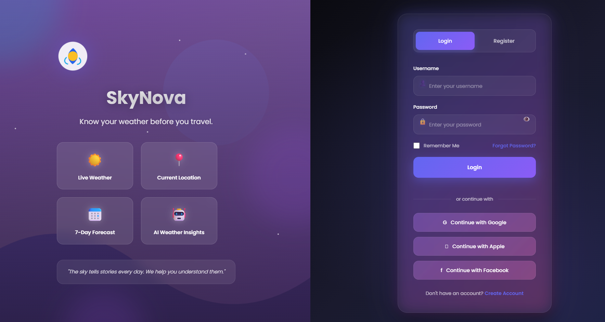
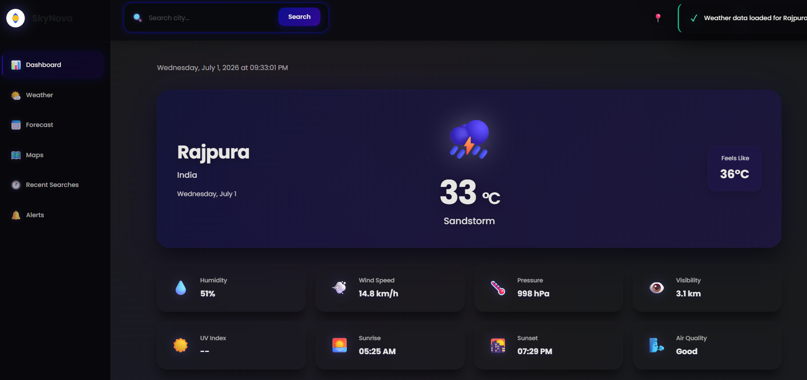
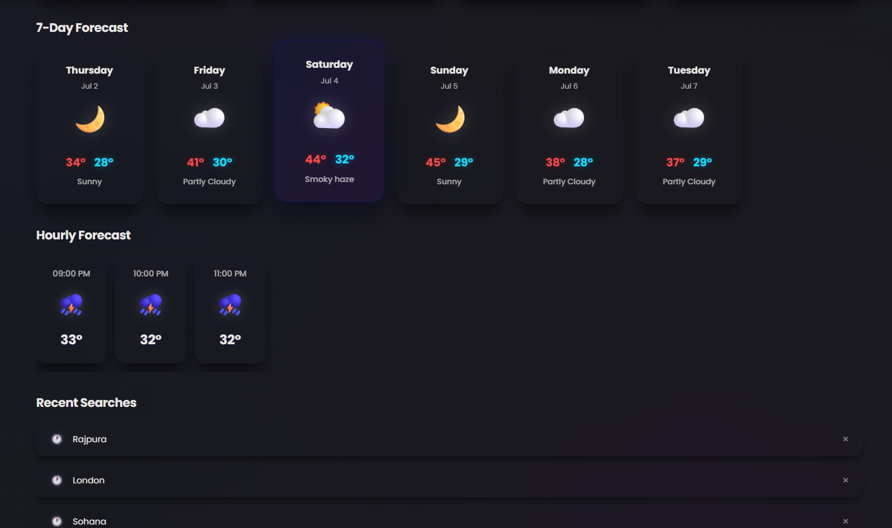

# 🌤️ SkyNova – Premium Weather Dashboard

**SkyNova** is a modern, responsive, and feature-rich weather dashboard built using **HTML, CSS, and JavaScript**. It provides real-time weather updates, multi-day forecasts, user authentication, location-based weather information, and a premium glassmorphism-inspired interface.

Designed as a **Web Development Mini Project**, SkyNova demonstrates modern frontend development concepts, API integration, responsive design, and clean UI/UX practices.

---

# 🚀 Features

### 🔐 Authentication

* Login & Register System
* JSON-based User Authentication
* Dynamic user registration using Local Storage
* Remember Me functionality
* Secure session management
* Input validation

### 🌦️ Weather Dashboard

* Real-Time Weather Information
* Search Weather by City
* Current Temperature
* Weather Condition
* Feels Like Temperature
* Humidity
* Wind Speed
* Atmospheric Pressure
* Visibility
* UV Index
* Air Quality
* Sunrise & Sunset
* Live Date & Time

### 📅 Forecast

* 7-Day Weather Forecast
* Hourly Forecast
* Dynamic Weather Icons
* Recent Searches
* Weather Status Cards

### 🎨 User Interface

* Premium Glassmorphism Design
* Modern Dark Theme
* Interactive Sidebar Navigation
* Beautiful Weather Cards
* Responsive Layout
* Smooth Hover Animations
* Mobile Friendly Design
* Professional Dashboard UI

---

# 🛠️ Tech Stack

* HTML5
* CSS3
* JavaScript (ES6)
* Fetch API
* Local Storage
* JSON
* OpenWeather API *(or WeatherAPI, depending on your implementation)*
* Git
* GitHub

---

# 📂 Project Structure

```text
SkyNova/
│
├── assets/
│   ├── logo.svg
│   ├── avatar.png
│   └── weather-icons/
│
├── css/
│   ├── style.css
│   └── dashboard.css
│
├── js/
│   ├── login.js
│   └── dashboard.js
│
├── index.html
├── dashboard.html
├── users.json
├── README.md
└── .gitignore
```

---

# 👤 Demo Credentials

| Username    | Password        |
| ----------- | --------------- |
| **admin**   | **password123** |
| **student** | **jsbasic2026** |

You can also register a new account directly from the application.

---

# 🌍 Weather Information Displayed

* 🌡️ Current Temperature
* 🌤️ Weather Condition
* 📍 City & Country
* 💧 Humidity
* 🌬️ Wind Speed
* 🌡️ Pressure
* 👁️ Visibility
* ☀️ UV Index
* 🌅 Sunrise
* 🌇 Sunset
* 🌫️ Air Quality
* 📅 Hourly Forecast
* 📆 Weekly Forecast

---

# 🔑 API Configuration

### If using OpenWeather API

1. Visit **[https://openweathermap.org/api](https://openweathermap.org/api)**
2. Create a free account.
3. Generate your API Key.
4. Open **dashboard.js**
5. Replace

```javascript
const API_KEY = "YOUR_API_KEY";
```

with your own API key.

---

### If using WeatherAPI

1. Visit **[https://www.weatherapi.com/](https://www.weatherapi.com/)**
2. Create a free account.
3. Generate your API Key.
4. Replace the API key inside **dashboard.js**.

---

# ▶️ How to Run

### 1. Clone the Repository

```bash
git clone https://github.com/jiya1321/weather-app.git
```

### 2. Open the Project

Open the project folder in **Visual Studio Code**.

### 3. Configure the API Key

Add your Weather API key inside **dashboard.js**.

### 4. Run the Project

Open **index.html** using **Live Server** or any modern web browser.

---

# 📸 Screenshots

### 🔐 Login Page

Modern glassmorphism login and registration interface.



---

### 📊 Dashboard

Real-time weather dashboard with premium UI.




---

### 📅 Forecast

Interactive hourly and weekly weather forecast.



---

# 🎯 Learning Outcomes

This project demonstrates practical implementation of:

* Semantic HTML5
* CSS Flexbox & Grid
* Responsive Web Design
* JavaScript DOM Manipulation
* Fetch API
* Async/Await
* JSON Handling
* Local Storage
* User Authentication
* API Integration
* Version Control using Git & GitHub

---

# 📌 Future Enhancements

* 🌙 Light & Dark Mode Toggle
* 🗺️ Interactive Weather Maps
* 🤖 AI Weather Recommendations
* 🔔 Weather Alerts & Notifications
* 🎤 Voice Search
* 🌍 Multi-language Support
* 📱 Progressive Web App (PWA)
* ⭐ Favorite Cities
* 📊 Weather Analytics
* 📡 Offline Support

---

# 👩‍💻 Developer

**Jiya Agnihotri**

**GitHub:** [https://github.com/jiya1321](https://github.com/jiya1321)

---

# 📄 License

This project has been developed for **educational purposes** as part of a **Web Development Mini Project**.

---

# ⭐ About

**SkyNova** is a premium weather dashboard that combines **modern UI/UX, secure authentication, real-time weather updates, forecasts, and responsive design** into a single elegant web application.

It is designed to provide users with an intuitive weather experience while showcasing modern frontend development skills.

---